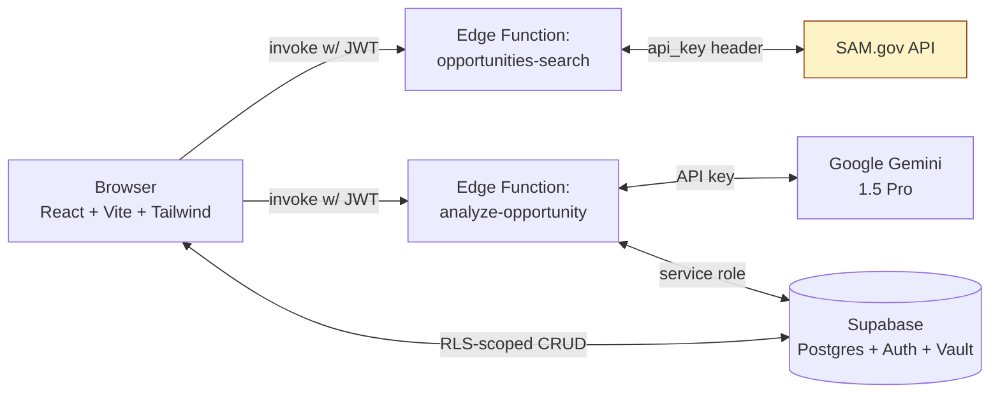

# OpenSAM — Autonomous Federal AI Agent

[](https://github.com/edgarfloresguerra2011-a11y/OpenSAM/actions/workflows/ci.yml)
[](LICENSE)
[](.nvmrc)
[](.prettierrc.json)

OpenSAM is an open-source platform that automates the discovery, analysis, and
proposal drafting for U.S. federal government contracts from **SAM.gov**. Built
for speed, reliability, and technical advantage in the federal contracting
space.

> ⚠️ **Status: alpha (v0.1.0).** The dashboard, opportunity search, AI analysis,
> and bid-save features work end-to-end. Multi-user auth, encrypted PII, and
> Edge Functions are wired in but should still be considered in beta. The
> Profile editor, Settings page, and audit log UI are functional but minimal.

---

## Table of contents

1. [Features](#-features)
2. [Architecture](#-architecture)
3. [Tech stack](#-tech-stack)
4. [Quick start](#-quick-start)
5. [Project structure](#-project-structure)
6. [Environment variables](#-environment-variables)
7. [Database migrations](#-database-migrations)
8. [Edge Functions](#-edge-functions)
9. [Testing](#-testing)
10. [Scripts](#-scripts)
11. [Security & compliance](#-security--compliance)
12. [Roadmap](#-roadmap)
13. [Contributing](#-contributing)
14. [Legal notice](#-legal-notice)

---

## 🚀 Features

| Feature                 | Status | Notes                                                                                                                                                  |
| ----------------------- | ------ | ------------------------------------------------------------------------------------------------------------------------------------------------------ |
| **Automated discovery** | ✅     | Real-time SAM.gov Public API integration via server-side Edge Functions.                                                                               |
| **AI-powered analysis** | ✅     | Gemini 1.5 Pro reads the full solicitation and returns structured JSON (summary, viability score, requirements, risks, missing certs, draft proposal). |
| **Smart scoring**       | ✅     | Local 0–100 pre-scoring (NAICS + set-aside + capabilities + deadline) — saves AI credits.                                                              |
| **Proposal drafting**   | ✅     | 150-word opening paragraph generated per opportunity.                                                                                                  |
| **Engagement CRM**      | ✅     | Save / unsave / soft-delete opportunities, all RLS-scoped.                                                                                             |
| **Multi-user auth**     | ✅     | Supabase Auth (PKCE flow, email + password).                                                                                                           |
| **Encrypted PII**       | ✅     | EIN and UEI encrypted at the column level via Supabase Vault + pgsodium.                                                                               |
| **Audit log**           | ✅     | Every analysis run is recorded with `user_id`, `entity_id`, and metadata.                                                                              |
| **Profile editor**      | 🟡     | Functional form for company name, EIN, UEI, NAICS, capabilities, certs.                                                                                |
| **Cron polling**        | 🔜     | Planned — Supabase scheduled function to poll SAM.gov for new opportunities.                                                                           |
| **Real-time dashboard** | 🔜     | Planned — Supabase Realtime subscriptions for collaborative saved lists.                                                                               |

---

## 🏗 Architecture



**Key design principle:** the browser never sees the SAM.gov API key or the
Gemini API key. Both live as Supabase secrets and are only accessible inside
the Edge Functions.

---

## 🛠 Tech stack

| Layer           | Technology                                                 |
| --------------- | ---------------------------------------------------------- |
| **Frontend**    | React 18 + TypeScript 5 + Vite 5                           |
| **Styling**     | Tailwind CSS 3 (Inter typeface, HubSpot-inspired palette)  |
| **Backend**     | Supabase Edge Functions (Deno)                             |
| **Database**    | Supabase (PostgreSQL 15) with Row Level Security           |
| **Auth**        | Supabase Auth (PKCE flow)                                  |
| **AI**          | Google Gemini 1.5 Pro (`@google/genai`) — 2M token context |
| **Data source** | GSA SAM.gov Public Opportunities API v2                    |
| **Encryption**  | Supabase Vault + pgsodium (XChaCha20-Poly1305-IETF)        |
| **Testing**     | Vitest + Testing Library + jsdom                           |
| **Linting**     | ESLint 9 (flat config) + Prettier 3                        |
| **CI/CD**       | GitHub Actions                                             |

---

## 🏁 Quick start

### 1. Prerequisites

- **Node.js** ≥ 18 (see `.nvmrc`)
- A **Supabase project** (free tier works)
- A **SAM.gov API key** (request at https://api.sam.gov)
- A **Google AI Studio API key** for Gemini (https://aistudio.google.com)

### 2. Install dependencies

```bash
npm install
```

### 3. Configure environment

Copy `.env.example` to `.env.local` and fill in your Supabase values:

```bash
cp .env.example .env.local
```

```env
VITE_SUPABASE_URL=https://your-project.supabase.co
VITE_SUPABASE_ANON_KEY=your-anon-key
```

> 💡 **Gemini and SAM.gov keys are NOT set here.** They are server-side secrets
> configured in step 6 below.

### 4. Run database migrations

Open Supabase Dashboard → SQL Editor → New Query, then run, **in order**:

1. `supabase/migrations/001_schema.sql`
2. `supabase/migrations/002_multiuser_rls.sql`
3. `supabase/migrations/003_pii_encryption.sql`
4. `supabase/migrations/004_audit_and_indexes.sql`

> ⚠️ Migration `003` requires the **Vault** extension — enable it first in
> Database → Extensions → search "vault" → enable.

### 5. Deploy Edge Functions

Install the Supabase CLI: https://supabase.com/docs/guides/cli

```bash
supabase login
supabase link --project-ref your-project-ref

# Deploy
supabase functions deploy opportunities-search --no-verify-jwt
supabase functions deploy analyze-opportunity  --no-verify-jwt
```

### 6. Set server-side secrets

```bash
supabase secrets set GEMINI_API_KEY=AIzaSy...
supabase secrets set SAM_GOV_API_KEY=your-sam-key
supabase secrets set CORS_ALLOW_ORIGIN=https://your-app.com   # optional, defaults to *
```

### 7. Run the app

```bash
npm run dev
```

Visit http://localhost:5173 and sign up. You're live. 🎉

---

## 📁 Project structure

```
OpenSAM/
├── .github/workflows/        # CI + edge-function deploy
├── .husky/                   # pre-commit hook (lint-staged)
├── .vscode/                  # editor recommendations + settings
├── src/
│   ├── components/
│   │   ├── analyzer/         # AnalyzerPanel (AI results drawer)
│   │   ├── auth/             # AuthPage + ProtectedRoute
│   │   ├── common/           # ErrorBoundary + Skeletons
│   │   ├── dashboard/        # Dashboard, Filter, Stats, OpportunityCard
│   │   ├── layout/           # Sidebar + TopBar
│   │   └── profile/          # ProfilePage
│   ├── hooks/                # useOpportunities, useAnalyzer
│   ├── lib/                  # env.ts, supabase.ts, api.ts, auth.tsx
│   ├── services/             # samApi, gemini, database, demoData, demoAnalysis
│   ├── test/                 # Vitest setup
│   ├── types/                # Domain types (Opportunity, BidAnalysis…)
│   ├── App.tsx
│   ├── main.tsx
│   └── index.css             # Tailwind + component classes
├── supabase/
│   ├── functions/
│   │   ├── _shared/          # cors.ts, auth.ts, sam-gov.ts, gemini.ts
│   │   ├── opportunities-search/index.ts
│   │   ├── analyze-opportunity/index.ts
│   │   ├── deno.json
│   │   └── import_map.json
│   ├── migrations/
│   │   ├── 001_schema.sql
│   │   ├── 002_multiuser_rls.sql
│   │   ├── 003_pii_encryption.sql
│   │   └── 004_audit_and_indexes.sql
│   └── config.toml
├── .editorconfig
├── .env.example
├── .gitignore
├── .nvmrc
├── .prettierrc.json
├── CODE_OF_CONDUCT.md
├── CONTRIBUTING.md
├── LEGAL.md
├── LICENSE
├── README.md
├── SECURITY.md
├── eslint.config.js
├── index.html
├── package.json
├── postcss.config.js
├── tailwind.config.js
├── tsconfig.json
├── tsconfig.node.json
├── tsconfig.test.json
├── vite.config.ts
└── vitest.config.ts
```

---

## 🔐 Environment variables

| Variable                    | Where                   | Purpose                                                   |
| --------------------------- | ----------------------- | --------------------------------------------------------- |
| `VITE_SUPABASE_URL`         | `.env.local`            | Browser-facing Supabase URL.                              |
| `VITE_SUPABASE_ANON_KEY`    | `.env.local`            | Browser-facing anon key (safe because RLS protects data). |
| `VITE_DEMO_MODE`            | `.env.local` (optional) | Force demo mode (returns sample data).                    |
| `VITE_FUNCTIONS_BASE_URL`   | `.env.local` (optional) | Override Edge Function base URL.                          |
| `GEMINI_API_KEY`            | `supabase secrets set`  | Server-only — Gemini AI.                                  |
| `SAM_GOV_API_KEY`           | `supabase secrets set`  | Server-only — SAM.gov API.                                |
| `CORS_ALLOW_ORIGIN`         | `supabase secrets set`  | Lock CORS to your origin (recommended in prod).           |
| `SUPABASE_URL`              | Auto-set by platform    | Edge Function runtime.                                    |
| `SUPABASE_ANON_KEY`         | Auto-set by platform    | Edge Function runtime.                                    |
| `SUPABASE_SERVICE_ROLE_KEY` | Auto-set by platform    | Edge Function runtime.                                    |

---

## 🗄 Database migrations

| File                        | Purpose                                                                                                                       |
| --------------------------- | ----------------------------------------------------------------------------------------------------------------------------- |
| `001_schema.sql`            | Initial tables: `saved_opportunities`, `bid_analyses`, `company_profiles`.                                                    |
| `002_multiuser_rls.sql`     | Adds `user_id`, drops dangerous `using (true)` policies, creates `auth.uid()`-scoped RLS, adds indexes, `updated_at` trigger. |
| `003_pii_encryption.sql`    | Encrypts EIN and UEI via Vault + pgsodium; drops plaintext columns; adds `SECURITY DEFINER` decrypt function.                 |
| `004_audit_and_indexes.sql` | Adds `audit_log` table, more indexes, soft-delete column, view, audit trigger.                                                |

> **Rule:** never edit a migration that's already been applied to production.
> Add a new `005_*.sql` file instead.

---

## 🧩 Edge Functions

| Function               | Method | Auth         | Purpose                                                        |
| ---------------------- | ------ | ------------ | -------------------------------------------------------------- |
| `opportunities-search` | POST   | JWT required | Proxy SAM.gov search; returns normalized opportunities.        |
| `analyze-opportunity`  | POST   | JWT required | Call Gemini with the opportunity + user profile, cache result. |

Both enforce JWT verification, follow CORS, and use the user's JWT for RLS-aware
Supabase queries (so they only see the user's own data).

Local development:

```bash
supabase functions serve --env-file .env.local
```

---

## 🧪 Testing

```bash
npm run test            # run once
npm run test:watch      # watch mode
npm run test:ui         # browser UI
npm run test:coverage   # coverage report → ./coverage/
```

Tests live next to the source files (`*.test.ts(x)`). Coverage thresholds are
configured in `vitest.config.ts`.

---

## 📜 Scripts

| Script                  | What it does                             |
| ----------------------- | ---------------------------------------- |
| `npm run dev`           | Start Vite dev server.                   |
| `npm run build`         | Type-check + production build → `dist/`. |
| `npm run preview`       | Preview the production build.            |
| `npm run lint`          | ESLint check.                            |
| `npm run lint:fix`      | ESLint with `--fix`.                     |
| `npm run format`        | Prettier write.                          |
| `npm run format:check`  | Prettier check (CI).                     |
| `npm run typecheck`     | `tsc --noEmit`.                          |
| `npm run test`          | Vitest single run.                       |
| `npm run test:coverage` | Vitest with coverage.                    |

---

## 🛡 Security & compliance

See [SECURITY.md](SECURITY.md) for the full policy and [LEGAL.md](LEGAL.md)
for legal notices. Key points:

- **API keys are server-only.** Gemini and SAM.gov keys never reach the browser.
- **Row Level Security is on every table**, scoped to `auth.uid()`.
- **PII is encrypted at rest** (EIN, UEI).
- **Audit log** records every AI analysis run.
- **OpenSAM is not affiliated with the U.S. Government.** Use of the SAM.gov
  API is subject to the
  [GSA API Terms of Use](https://open.gsa.gov/api/api-terms-of-use/).
- Supabase is **not FedRAMP-authorized**. For federal workloads requiring
  FedRAMP Moderate+, deploy in AWS GovCloud or Azure Government with an
  authorized Postgres provider.

---

## 🗺 Roadmap

- [ ] Cron-based SAM.gov polling (scheduled Edge Function)
- [ ] Supabase Realtime for shared saved-opportunity lists
- [ ] Per-team workspaces (multiple company profiles per user)
- [ ] PDF parser so Gemini can read full RFP attachments
- [ ] Proposal editor with version history
- [ ] WCAG 2.1 AA conformance audit (axe-core in CI)
- [ ] i18n (English + Spanish)
- [ ] Mobile-responsive sidebar (drawer on small screens)

---

## 🤝 Contributing

Pull requests are welcome! Please read [CONTRIBUTING.md](CONTRIBUTING.md)
and [CODE_OF_CONDUCT.md](CODE_OF_CONDUCT.md) first.

The TL;DR:

1. Branch from `main`, target `main`.
2. Run `npm run lint && npm run typecheck && npm run test` before pushing.
3. Don't expose any new API key or secret in the frontend bundle.
4. Don't edit existing migrations — add new ones.
5. Use the PR template; fill in the security section.

---

## 📜 Legal notice

OpenSAM is an independent open-source project. It is not affiliated with,
endorsed by, sponsored by, or in any way officially connected with the U.S.
General Services Administration (GSA), SAM.gov, or any other U.S. government
agency. See [LEGAL.md](LEGAL.md) for the full notice.

AI-generated content (viability scores, risk summaries, draft proposals) may
contain errors. Always verify against the original solicitation and have a
qualified human review any proposal text before submission.

---

Built with ❤️ by [AliceLabs LLC](https://alicelabs.site). Released under the
[MIT License](LICENSE).
